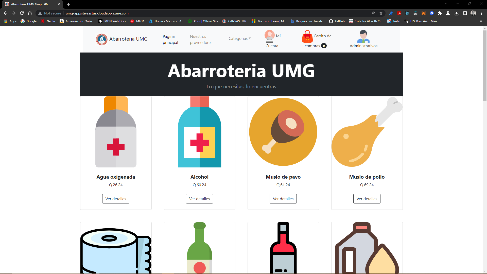
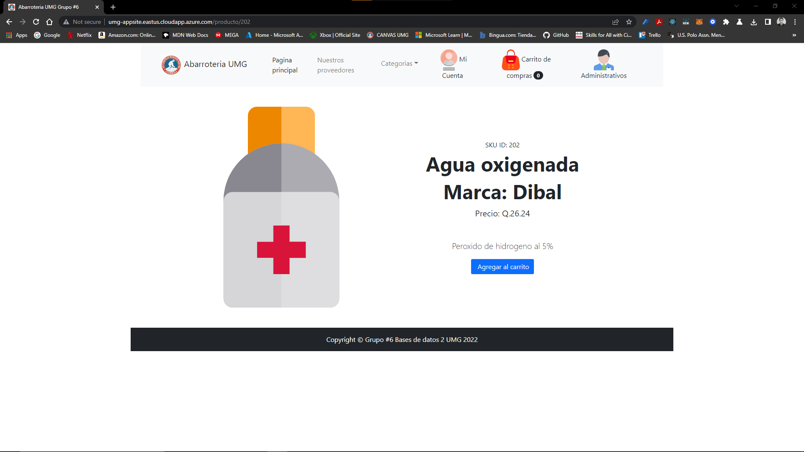
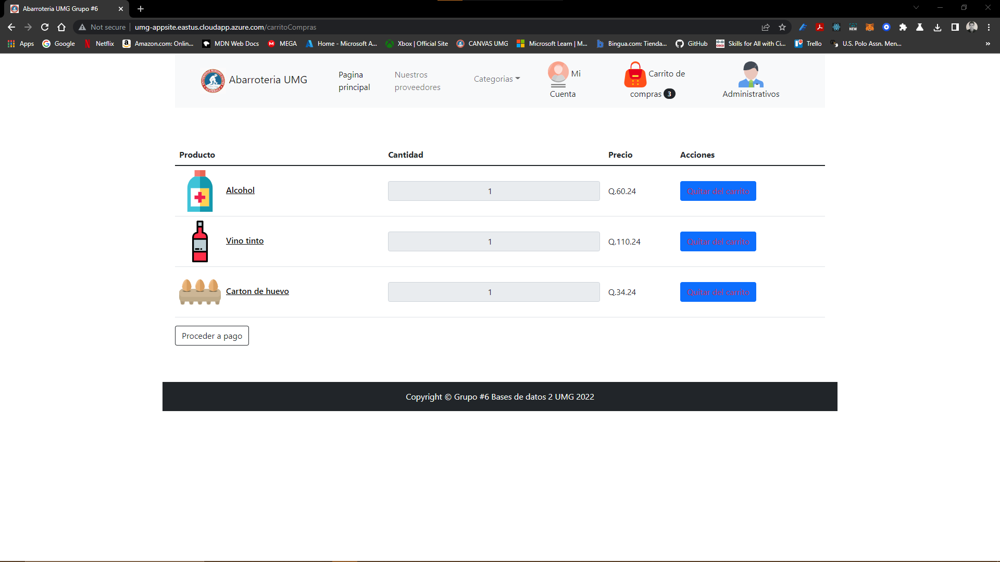
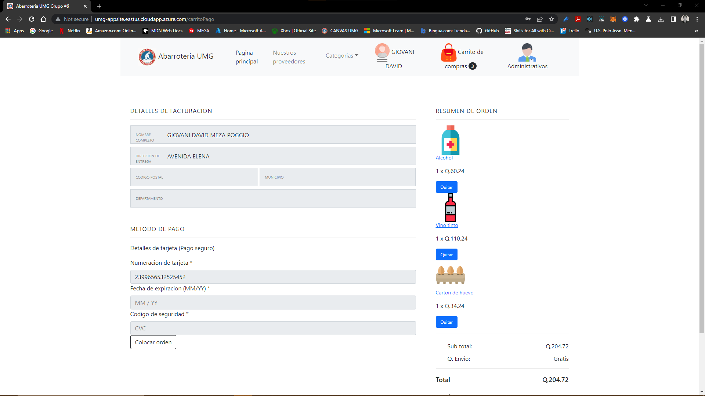
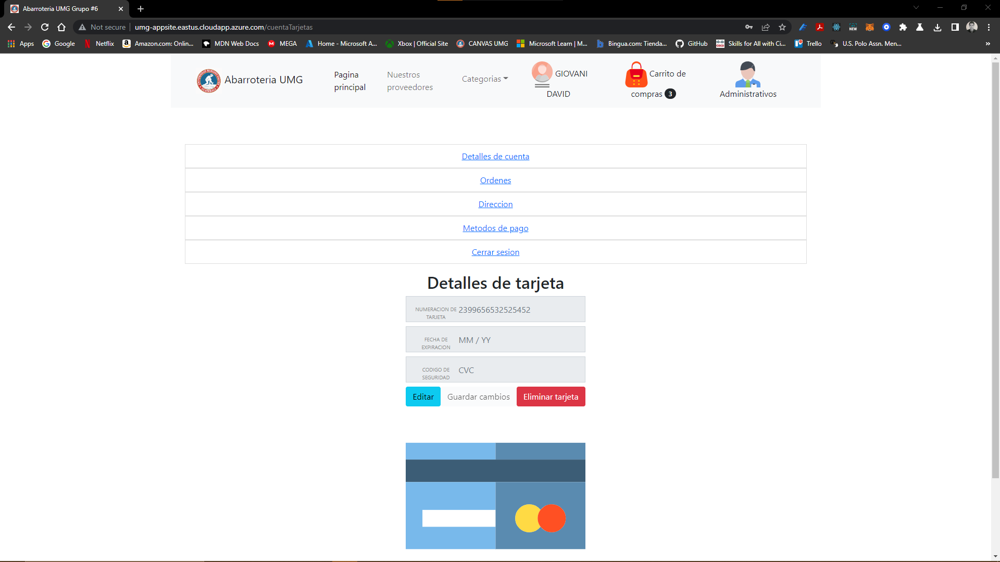
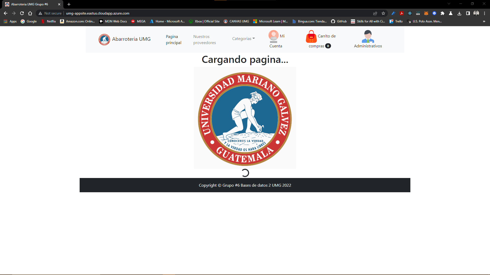

# Grocery Store UMG
Grocery store small website, intented to provide modern and highly available features, hosted in Microsoft Azure.
# Azure hosting preview(under maintenance)
[http://umg-appsite.eastus.cloudapp.azure.com/](http://umg-appsite.eastus.cloudapp.azure.com/)








# Features
* PDF invoice generation.
* Account management(Sign-up or Sign-in).
* Shopping cart persistent on session.
# Dashboard
| CodeFactor Grade  |
|   :--------------:|
| [![cf-badge]][cf-site]

[cf-site]: https://www.codefactor.io/repository/github/meza360/grocery-store-webapp
[cf-badge]: https://www.codefactor.io/repository/github/meza360/grocery-store-webapp/badge
# Developing and testing
```powershell
PS D:\grocery-store-webapp\backend> dotnet run --project .\API\
PS D:\grocery-store-webapp\frontend> npm start
```
# Building
```powershell
PS D:\grocery-store-webapp\backend> dotnet build --project . -c Release --self-contained=false -o .\buildApi\
PS D:\grocery-store-webapp\frontend> npm run build .\frontend\
```
# Deploying
See our guide in [linux-basic-administration](https://www.google.com) to deploy your app on a server environment using [Nginx](https://www.nginx.com/) and [NetCore Runtime Environment](https://dotnet.microsoft.com/en-us/download)
# Clean architecture
* API/Application/Persistence/Domain - C#/NetCore 6
* Database - Oracle 21g/Oracle 21c/Oracle RAC OneNode/ High Availability
* Presentation - ReactJS/Typescript/MobX/React bootstrap